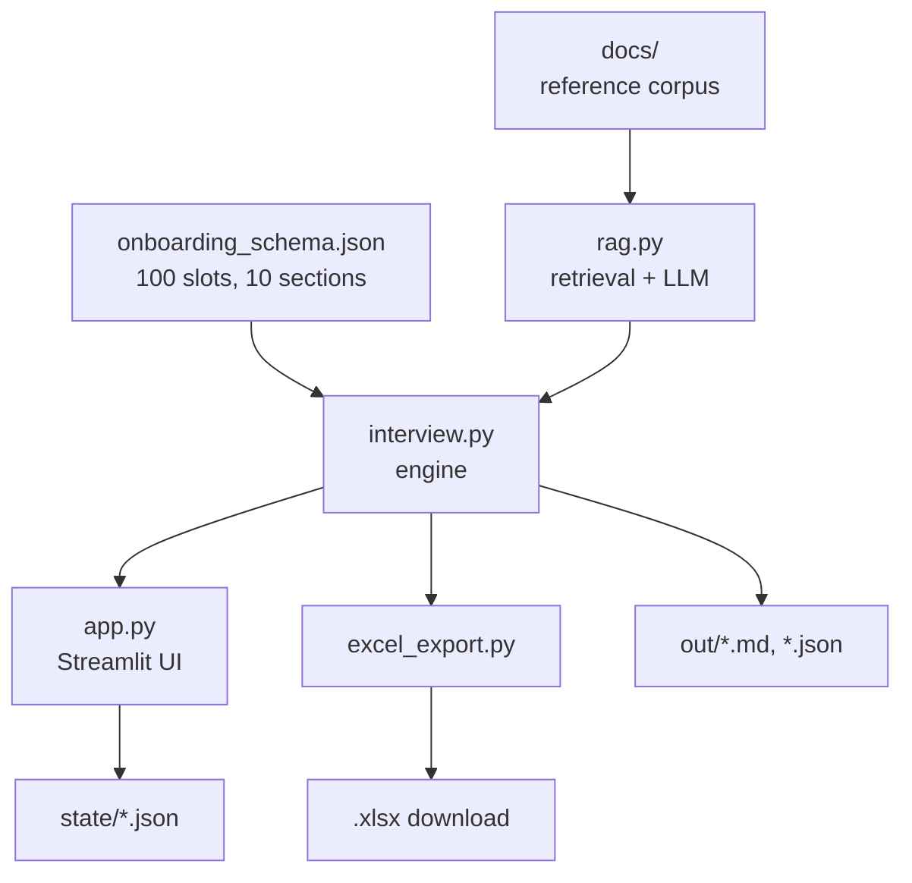

# Technical Documentation

**ISC Source Onboarding** — a schema-driven, RAG-grounded intake application that
interviews an application owner in plain language and produces a complete,
citation-backed onboarding specification for a SailPoint Identity Security Cloud
source.

---

## 1. Purpose and scope

Onboarding an application as an ISC source requires a large, branching set of
facts: where user data lives, how to reach it, how accounts correlate to
identities, what should happen on joiner/mover/leaver, and how entitlements are
governed. Gathering these over email and calls is slow and lossy — gaps surface
weeks into the build.

This application replaces that conversation with a structured interview. It
guarantees **deterministic coverage**: every applicable requirement is asked,
and anything unanswered is reported explicitly rather than silently missed.

**Out of scope.** The application never calls the ISC API and provisions nothing.
It produces a document a human engineer builds from.

---

## 2. Architecture



The defining property is that **the domain lives in data, not code**. Neither
`interview.py` nor `app.py` contains any ISC knowledge. Every question, branch,
hint and validation rule is JSON. Point the engine at a different schema and
corpus and it runs an entirely different intake.

### Module responsibilities

| File | Responsibility |
| --- | --- |
| `onboarding_schema.json` | Domain model — questions, branching, grounding queries, validation rules |
| `interview.py` | Engine — applicability, state, reports, LLM-backed explain/validate. Also a CLI |
| `rag.py` | Retrieval — document loading, chunking, embedding, vector search, LLM client |
| `app.py` | Streamlit presentation and navigation |
| `excel_export.py` | Workbook generation via openpyxl |
| `docs/` | Reference corpus indexed for retrieval |
| `state/` | One JSON document per intake (gitignored) |
| `out/` | Generated Markdown and JSON reports (gitignored) |

---

## 3. Data model

### 3.1 Schema

Schema v2.0 — 100 slots across 10 sections, two audiences.

| Property | Count |
| --- | --- |
| Owner-facing slots | 83 |
| ISC developer slots | 17 |
| Conditional slots | 46 |
| Slots with a retrieval query | 24 |
| Slots with a validation rule | 19 |

Slot types: `text` (76), `choice` (19), `multi` (4), `bool` (1).

### 3.2 Slot definition

```json
{
  "id": "db_primary_key",
  "section": "data",
  "audience": "owner",
  "question": "What is the primary key of the user table, and is it ever reused?",
  "hint": "e.g. 'EMP_ID, never reassigned'",
  "why": "This becomes the account's permanent identifier in ISC.",
  "type": "text",
  "required": true,
  "applies_to_any": {
    "data_store_type": ["Relational database"],
    "integration_methods": ["Direct database connection"]
  },
  "grounding": "JDBC account query settings identity attribute",
  "validate": "The key must be unique and immutable."
}
```

| Field | Purpose |
| --- | --- |
| `id` | Stable key used in state and conditions |
| `section` / `audience` | Grouping and who answers it |
| `question` / `hint` / `why` | User-facing copy |
| `type` / `options` | Widget selection and permitted values |
| `required` | Drives submission gating |
| `applies_to` | Conditions, **AND** across keys |
| `applies_to_any` | Conditions, **OR** across keys |
| `grounding` | Retrieval query for this slot |
| `validate` | Rule the LLM checks the answer against |

### 3.3 Conditional logic

`applies_to` requires **every** named slot to match. `applies_to_any` requires
**at least one**. Both are satisfied if any selected value intersects the allowed
list, so multi-select answers work naturally.

This is what makes the interview adaptive: a vendor-SaaS REST source with no
access levels hides 17 slots; a database-backed source surfaces 18 JDBC-specific
questions that an API-backed source never sees.

### 3.4 Intake state

```json
{
  "name": "Acme Portal",
  "slug": "acme-portal",
  "created": "2026-09-24T09:00:00+00:00",
  "submitted_at": "2026-09-24T11:44:29+00:00",
  "answers": {
    "db_primary_key": {
      "value": "EMP_ID",
      "answered_at": "...",
      "review": "CONCERN\nIDs are reused after termination."
    }
  },
  "open_questions": {
    "db_row_counts": { "reason": "DBA to confirm" }
  }
}
```

Answers and open questions are mutually exclusive — flagging a question removes
any stored answer. Unknowns are tracked rather than silently absent, which is
what makes the completeness report trustworthy.

---

## 4. Retrieval pipeline

### 4.1 Ingest

Documents in `docs/` (`.pdf`, `.md`, `.txt`, `.json`, `.xml`, `.csv`, `.yaml`)
are loaded — PDFs page by page via PyMuPDF, others whole — then split by
`RecursiveCharacterTextSplitter` at 1000 characters with 150 overlap, embedded,
and persisted to Chroma at `.chroma/`.

`reset_collection()` runs first, so re-ingesting never duplicates chunks.

### 4.2 Embeddings

`sentence-transformers/all-MiniLM-L6-v2` — ~22M parameters, 384-dimensional
output, executed **locally**. Document text never leaves the host during ingest
or retrieval.

### 4.3 Query

A slot's `grounding` string is embedded and the 4 nearest chunks returned by
cosine similarity (`TOP_K = 4`). Grounding queries are written for retrieval
quality and deliberately differ from the user-facing question.

### 4.4 Known limitation

Dense embeddings blur exact identifiers — `scim-2.0-saas` and
`web-services-saas` are near-identical in vector space. For a corpus dense with
literal configuration names, hybrid BM25 + dense retrieval with reciprocal-rank
fusion is the highest-value improvement.

---

## 5. LLM usage

Two bounded call sites. The model never selects the next action.

### 5.1 Explain (`interview.explain_text`)

Retrieves 4 chunks and asks the model to explain the question using only that
context, name the pitfall, cite sources, and admit when the context is silent.
Measured cost: **808 prompt + 486 completion = 1,294 tokens**.

### 5.2 Validate (`interview.validate`)

Takes the answer, the slot's `validate` rule and retrieved context. The first
line of the response must be `PASS`, `CONCERN` or `UNKNOWN`. Results are
**advisory** — a concern is surfaced as a warning and never blocks progress.

### 5.3 Degradation

Both paths catch exceptions and fall back to returning the raw retrieved
documentation. With no API key or an invalid one, the application remains fully
usable; only the written summaries are lost.

---

## 6. Outputs

| Artefact | Produced by | Contents |
| --- | --- | --- |
| Markdown report | `interview.report()` | Answers grouped by audience and section, flagged items, open questions, completeness table |
| JSON | `interview.report()` | Raw state, used for backup and restore |
| Excel workbook | `excel_export.build()` | Summary · Intake · ISC Design · Open questions · Not answered |

The **Not answered** sheet lists required questions with no answer, so gaps
travel with the document instead of being lost.

Final submission is gated: the button is disabled while required questions are
outstanding, and an explicit override records the gaps rather than hiding them.

---

## 7. Configuration

| Variable | Default | Purpose |
| --- | --- | --- |
| `GROQ_API_KEY` | — | Required for explain and validate only |
| `GROQ_CHAT_MODEL` | `openai/gpt-oss-120b` | Groq chat model id |

Locally these come from `.env`. On a hosted platform they come from the platform
secret store; `app.py` copies them into the process environment at startup and
reports the reason if the secret store cannot be read.

Tunable constants in `rag.py`: `CHUNK_SIZE` (1000), `CHUNK_OVERLAP` (150),
`TOP_K` (4), `EMBED_MODEL`.

---

## 8. Deployment

Requires `requirements.txt`, Python 3.11–3.13, and `app.py` as the entry point.
The vector index self-builds on first retrieval if `.chroma/` is absent.

Two deployment-specific behaviours:

- `truststore` is imported optionally. It is needed only behind a TLS-inspecting
  corporate proxy and is absent on cloud hosts.
- `rag` is imported lazily inside functions. Importing it at module scope pulls
  in torch, which blocks first paint by 20–30 seconds and breaks Streamlit's file
  watcher.

Run locally with the file watcher disabled (`.streamlit/config.toml` sets this),
which means the server must be restarted manually after code changes.

---

## 9. Operational limits

| Constraint | Value | Impact |
| --- | --- | --- |
| Groq free tier | 1,000 requests/day | ~1,000 explain or validate calls |
| Groq free tier | 8,000 tokens/minute | ~6 calls/minute, shared across all users |
| Host filesystem | Ephemeral | `state/` is lost when the container restarts |

Mitigations: **Back up this intake** downloads the state JSON and **Restore from
a saved file** re-imports it. Lowering `TOP_K` or switching to
`openai/gpt-oss-20b` reduces token consumption.

---

## 10. Known gaps

1. **No per-user isolation.** The sidebar lists every intake on the host.
   Acceptable for a small trusted group; unsuitable for public deployment.
2. **No persistent storage.** State does not survive a host restart.
3. **Shared API quota.** All users consume one rate limit.
4. **Dense-only retrieval.** See §4.4.

---

## 11. Extending

**Add a question** — append a slot to `onboarding_schema.json`. No code change.
Give it a unique `id`, an existing `section`, and an `audience`. Add
`applies_to` / `applies_to_any` to make it conditional, `grounding` to enable the
docs explainer, and `validate` to enable checking.

**Change the corpus** — drop files into `docs/` and run `python rag.py ingest`.

**Repoint the domain** — replace the schema and corpus. The engine carries no
domain knowledge.

---

## 12. Technology stack

Versions as installed.

### AI / ML

| Component | Version | Role |
| --- | --- | --- |
| sentence-transformers | 6.1.0 | Runs the local embedding model |
| all-MiniLM-L6-v2 | — | ~22M parameters, 384-dimensional vectors |
| torch | 2.14.0 | CPU inference backend for the embedder |
| transformers | 5.17.0 | Model loading |
| tokenizers | 0.23.2 | Tokenisation |
| groq | 0.37.1 | Hosted LLM client |
| openai/gpt-oss-120b | — | 117B MoE open-weight model, 128k context |

### Vector store

| Component | Version | Role |
| --- | --- | --- |
| chromadb | 1.5.9 | Embedded vector database persisted to `.chroma/` |
| numpy | 2.5.3 | Vector maths |
| onnxruntime | 1.30.0 | Chroma dependency |

### Orchestration

| Component | Version | Role |
| --- | --- | --- |
| langchain-core | 1.6.4 | `Document`, `ChatPromptTemplate`, LCEL piping |
| langchain-text-splitters | 1.1.2 | `RecursiveCharacterTextSplitter` |
| langchain-chroma | 1.1.0 | Chroma integration |
| langchain-huggingface | 1.2.2 | Embeddings integration |
| langchain-groq | 1.1.3 | `ChatGroq` client |
| langchain | 1.4.2 | Umbrella package |

### Application

| Component | Version | Role |
| --- | --- | --- |
| streamlit | 1.64.0 | Web UI, session state, secrets |
| openpyxl | 3.1.5 | Excel workbook generation |
| pymupdf | 1.28.2 | PDF text extraction |
| python-dotenv | 1.2.3 | Loads `.env` |
| truststore | 0.10.4 | Optional — Windows cert store for TLS-inspecting proxies |

### Runtime

Python 3.14.1 locally, 3.12 recommended for deployment. Persistence is flat JSON
with no database, message queue or cache. Chroma is embedded rather than a
server, which is why deployment is a `git push` — and why state does not survive
a container restart.

---

## 13. Component reference

| Function | Module | Notes |
| --- | --- | --- |
| `load_documents(dir)` | `rag` | Multi-format loader |
| `ingest()` | `rag` | Rebuilds the collection from scratch |
| `retrieve(query, k)` | `rag` | Similarity search |
| `chat(temperature, api_key)` | `rag` | Groq client; per-call key avoids cross-user leakage |
| `applicable(slot, answers)` | `interview` | Evaluates both condition styles |
| `pending(schema, state, audience)` | `interview` | Unresolved applicable slots |
| `explain_text(slot, api_key)` | `interview` | Returns `(text, sources)` |
| `validate(slot, value, api_key)` | `interview` | Returns a verdict string |
| `report(slug)` | `interview` | Writes Markdown + JSON, returns the Markdown |
| `build(schema, state)` | `excel_export` | Returns `.xlsx` bytes |
